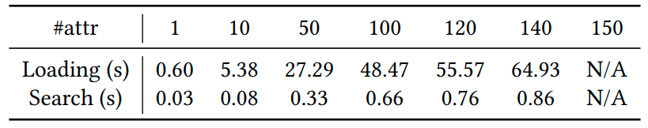

# ManiRender

## 📝 Introduction

ManiRender is a search algorithm for image editing script synthesis
using [lattice](https://en.wikipedia.org/wiki/Lattice_(order)).


## 🐳 Docker

We recommend to user Docker and then you can skip `🛠️ Dependencies & Installation`.

```shell
docker build -t manirender .
docker run -it --name manirender manirender:latest /bin/zsh
conda activate ManiRender
```

## 🛠️ Dependencies & Installation

##### Hardware

- CPU: 2.0 Ghz
- RAM: 32G
- OS: Debian 12
- Python: 3.8.19

##### Python environment management

- [Conda](https://conda.io/projects/conda/en/latest/index.html)

##### CV tools:

- Attribute/vehicle analysis: [PaddleDetection](https://github.com/PaddlePaddle/PaddleDetection)
- Age/gender prediction: [MiVOLO](https://github.com/WildChlamydia/MiVOLO)
- OCR: [PadddleOCR](https://github.com/PaddlePaddle/PaddleOCR)
- Image inpainting: [Inpaint-Anything](https://github.com/geekyutao/Inpaint-Anything)
- Instance segmentation: [SAM](https://github.com/facebookresearch/segment-anything)

##### LLMs

- [ChatGPT4](https://openai.com/index/gpt-4/) `gpt-4o-2024-08-06`

##### Installation

1. (optional) [install.md](install.md): install CV tools to preprocess data, or use our [processed data](benchmarks);
2. [download.sh](cv_tools/configs/download.sh): download pre-trained models;
3. [baselines/eusolver/README.md](baselines/eusolver/README.md): install EUSolver.

## 🔖 How to use

#### ManiRender

```shell
# 1. Synthesize programs with ManiRender
python __main__.py --difference 1 --abstraction 1 # MainRender
# 2. ablation study
python __main__.py --difference 0 --abstraction 0 # MainRender w/o Diff + Abst
python __main__.py --difference 0 --abstraction 1 # MainRender w/o Diff
python __main__.py --difference 1 --abstraction 0 # MainRender w/o Abst
```

#### ImageEye

```shell
# 1. Ensure you are under the root directory of this repo
# 2. Synthesize programs with ImageEye
python -m baselines.ImageEye.__main__
```

#### EUSolver

```shell
# 1. Install EUSolver by following `baselines/eusolver/README.md`
# 2. Synthesize programs with EUSolver
cd baselines/eusolver/src
python __main__.py
```

#### GPT4

```shell
# 1. resize image inputs for GPT
python -m benchmarks.prepare_prompts
# 2. Ensure you are under the root directory of this repo
cd baselines/gpt4
# 3. set your OpenAI API in ManiRender/baselines/gpt4/__main__.py before execution
python __main__.py
```

#### Scalability Analysis

```shell
# at least 32 GB memory
python -m scalability.__main__
```

## 🐎 Experiments

#### Benchmarks

MainRender is evaluated on 100 tasks for 20 images. Each task involves an image and extracted attributes with existing
CV tools.

*Images are collected from https://search.creativecommons.org/.*

#### RQs

RQ1. Effectiveness

ManiRender can solve 98 out 100 tasks in an average time of 7.4s and only
fails in two tasks because of insufficient labels.

RQ2. Comparison against existing tools and LLMs


RQ3. Ablation study


RQ4. Scalability




#### Evaluation Scripts

- calculate statistics and draw cactus plots

```shell
# save in `rqs`
python -m rqs.eval --directory benchmarks
python -m rqs.plots --directory benchmarks
```

- reproduce our tables and figures

```shell
# save in `rqs`
python -m rqs.eval --directory history 
python -m rqs.plots --directory history
```

## 🖥️ Other resources

- [exec_actions.py](exec_actions.py): manipulate images using CV tools (*set performance-critical configuration to reach
  high-quality outputs*)
- [history](history): our results
- [bad_cases.txt](bad_cases.txt): failure cases and groundtruths

## License

ManiRender is licensed under [CC-BY-4.0](CC-BY-4.0).